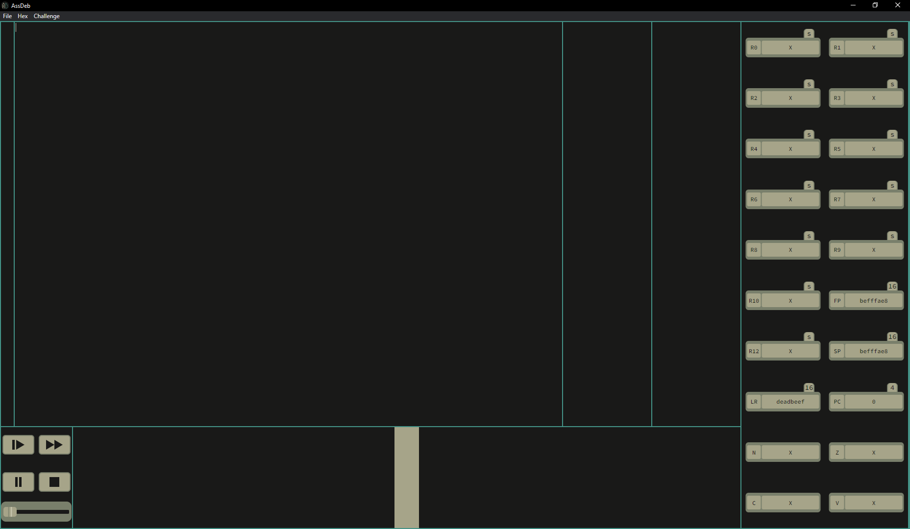

# What is AssDeb?

AssDeb is a debugger made for assembler directly inspired by Zachtronics game. At the moment, it only supports armv4 but should be extended in the future to support other languages.

# Why use AssDeb?

AssDeb is unlike most other debuggers in the sense that it doesn't really run the program on the machine, interrupting it using system calls to get the data. AssDeb interprets himself the behaviour of the program. This has advantages and disadvantages. 

One disadvantage is that the whole behaviour of the program in the debugger directly depends on AssDeb's program and on nothing else so if the programmer didn't understand the convention of an instruction, this instruction will not be executed how it should. It also adds a lot of complexity in the application given it has to contain a full interpreter of any language it wants to debug.

The advantages are the easy access to all of the memory and the fact that the program runs smoother by not having to do interruptions to speak to the OS to run and stop the program.

# How to download it?

For Mac OS, as code signing is necessary to run a program and I don't want to pay for it, you will have to build it yourself. See the next section for more information.

For Windows and Linux users, you can find the current release on this page: https://github.com/TheTarados/AssDeb/releases/latest.

Download it, extract it and run the binary assdeb(.exe) inside it. AssDeb should run!

# How to build it?

1. Install Node.js from https://nodejs.org/en/download/.

2. Clone this repository.

3. Run `npm install` in your terminal.

4. Run `npm start` in your terminal.

5. AssDeb should run!

# How to use AssDeb?

AssDeb has 6 zones.
1. The text area, where you can write your code. It should respect the syntax of the language. The line numbers on the left are directly linked to the position in memory of the instruction. A click on the number of a line will toggle a breakpoint on this line. A breakpoint is a point where the program will stop when it reaches it using run.
2. The stack area, showing the content of the stack.
3. The heap area, showing the content of the heap.
4. The register area, showing the content of the registers and of the flags.
5. The button area, where you can interact with the execution of your program. The buttons are step, run, pause and stop. The slider under it manages the speed of the run state, left being slow and right being fast.
6. The timeline, where you can see what instruction the program executed in past steps, and what it will execute in future steps. A click on one of the instruction will make the program change to the corresponding state.

The File menu in the bar on the top of the window lets you:
- Open a file, in which case its content will show in the text area. 
- Close the file. This will clear the text area and reset the auto-save pat.
- Save a file, in which case the content of the text area can be written to a file.
- Select a language, which is a WIP feature to support more than ArmV4. (Armv5 is not functional yet.)
Note: Opened files will automatically receive changes via an auto-save: upon saving to a file or opening a file, any change done to the text area will impact the file you last opened/saved to. Closing the file will stop this synchronization.

The Hex menu in the bar on the top of the window lets you:
- Generate the Hex of the current code and put it in your clipboard.
- Generate the Hex of the current code and put it in a file.

The Challenge menu:
- Open a challenge of your choice. This will switch to a layout with a description of the task at the bottom of the text area and a zone with the input/output of the tests on right of the text area. You can simply run your program to see the results. Upon completion of the tests, the timeline will be replaced with an indication of the success of the tests and the performances of your program.
- Close the challenge and go back to the normal layout.

# Is AssDeb bug-free?

Most likely not and you should thus be cautious when using AssDeb. It is a good idea to run your code on another debugger if your application is critical and/or uses complicated features of the language.

In most use cases, the debugger should give the right result but if you find any error, please create an issue on GitHub, showing the code which creates the bug and, if possible, what GDB indicates as solution.

# Can I contribute?

Yes, any help is welcome! Don't hesistate to contact me to know how you could add to this project.
